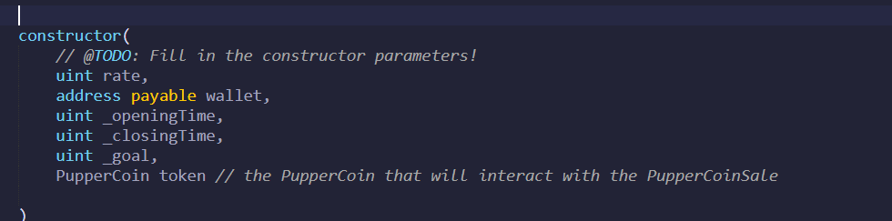
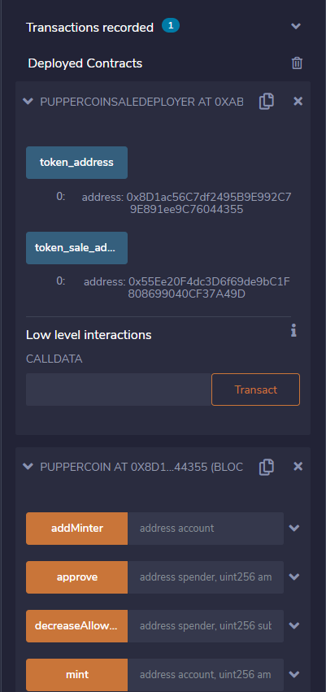

# Coinsale_Crowdsale

We need to create an ERC20 token that will be minted through a Crowdsale contract that can leverage from the OpenZeppelin Solidity library.

This crowdsale contract will manage the entire process, allowing users to send ETH and get back PUP (PupperCoin). This contract will mint the tokens automatically and distribute them to buyers in one transaction.

It will inherit `Crowdsale`, `CappedCrowdsale`, `TimedCrowdsale`, `RefundableCrowdsale`, and `MintedCrowdsale`.

Then conduct the crowdsale on the Kovan or Ropsten testnet in order to get a real-world pre-production testing.

## Steps:

1. Using Remix, created a file called PupperCoin.sol and create a standard `ERC20Mintable` token. I used a standard `ERC20Mintable` and `ERC20Detailed` contract, hardcoding `18` as the `decimals` parameter, and leaving the `initial_supply` parameter alone.

2. Created a new contract named PupperCoinCrowdsale.sol, with standard crowdsale features.

3.Then bootstrapped the contract by inheriting the following OpenZeppelin contracts:
* `Crowdsale`

* `MintedCrowdsale`

* `CappedCrowdsale`

* `TimedCrowdsale`

* `RefundablePostDeliveryCrowdsale`

3. It is important to note that the RefundableCrowdsale constructor is called instead of the RefundablePostDeliveryCrowdsalecontract because RefundablePostDeliveryCrowdsale inherits the RefundableCrowdsale constructor.

4. The parameters are set as follows: 

* _goal is the goal set for the crowdsale which is `300 ETH`
* _openingTime is set at   `now`
* _closingTime is set at `now +24 weeks`
* wallet is `beneficiary`
* Token is `PupperCoin`

## Testing the contract:

I tested the contract on using Ganache accounts.

1. Connect the Remix to the Metamask account.
2. Compile Crowdsale.sol  and deploy the PupperCoinSaleDeployer.sol
3. Under deploy, set name, symbol, wallet address of metamask and goal(300eth).
4. Hit Transact and hit confirm on the Metamask popup.
5. Under Deployed Contracts, copy the value given for token_address
6. Select PupperCoin from the contract dropdown menu and paste the token address to At Address field then click the At Address button.
7. Copy the token_sale_address from the PupperCoinSaleDeployer deployed contract and switch the contract to PupperCoinSale then paste the token_sale_address into the AT Address field and click At Address button.
8. Under Deployed Contracts, expand the PupperCoinSale contract and enter an address from Ganache as the beneficiary under buyTokens.

